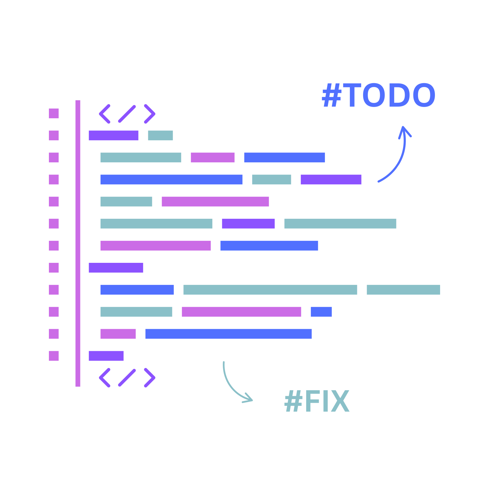

<div align="center">
  

  <h1>comment-todo</h1>

  <p>
	<a href="#features">features</a> •
	<a href="#Install">Installation</a> •
	<a href="#Usage">Usage</a>
  </p>


  <p>
    <a href="https://github.com/Silent-Watcher/comment-todo/blob/master/LICENSE">
      
    </a>
  </p>

  <p>⭐️ Please press the star! It greatly helps development! ⭐️</p>
  <p>CLI that scans source files for comment tags (`TODO`, `FIXME`, `HACK`) and generates a `TODO.md`.</p>


</div>


## Install

```bash
npm i -g comment-todo
```

## CLI design

```sh
Usage: comment-todo [options]


Options:
-r, --root <path> Project root (default: .)
-o, --out <path> Output file (default: TODO.md)
-e, --ext <exts> Comma-separated file extensions to include (default: js,ts,jsx,tsx,py,sh)
-p, --pattern <glob> Additional include glob (can be used multiple times)
-x, --exclude <glob> Exclude glob (default: node_modules/**,.git/**)
-f, --format <format> Output format: markdown|json (default: markdown)
--dry-run Print results to stdout instead of writing file
--verbose Verbose logging
-h, --help display help for command
```

## Usage

```bash
npx comment-todo --root . --out TODO.md
# or
npx comment-todo --out - --format json
```

## Features

- AST-backed scanning for JavaScript/TypeScript (reduces false positives).
- PHP comment extraction using php-parser.
- Fallback scanning for Python, Go, shell scripts and others.
- Metadata parsing for assignee/due etc. (e.g. TODO(@alice due:2025-09-01): message).

## Examples: comment variants & expected output

Below are *representative* comment examples (across languages) and the **expected `TODO.md` output** produced by the CLI.

> **Notes:**
> AST-backed parsing is used for **JavaScript/TypeScript** which avoids matching `TODO` inside string literals. For languages where we use line-based fallback (Python, Go, Shell), the extractor uses heuristics (comment prefixes) to reduce false positives but may still have edge-cases.
> Metadata parsing supports `@assignee`, `assignee:key`, `due:YYYY-MM-DD` inside parentheses or comma-separated pairs. Example: `TODO(@alice due:2025-09-01): message`.

---

### Example 1 — JavaScript, single-line and block comments

**`src/example1.js`**
```js
// TODO: implement user login
const s = "this is not a // TODO: fake"; // not a todo (string)
/* FIXME: remove this deprecated method */
/*
 * HACK: temporary workaround for issue #42
 * Details: this will be removed later
 */
```

**Expected TODO.md**
```md
# TODOs (generated by comment-todo)

## src/example1.js

- [TODO] (line 1) implement user login
- [FIXME] (line 3) remove this deprecated method
- [HACK] (line 5) temporary workaround for issue #42 — _no meta_

---
Generated: <timestamp>
```

### Example 2 — JavaScript with metadata (assignee & due)

**`src/example2.js`**

```js
// TODO(@alice, due:2025-09-01): add input validation
// FIXME(assignee:bob): fix edge-case on windows
```
**Expected TODO.md**

```md
# TODOs (generated by comment-todo)

## src/example2.js

- [TODO] (line 1) add input validation — _assignee:alice, due:2025-09-01_
- [FIXME] (line 2) fix edge-case on windows — _assignee:bob_

---
Generated: <timestamp>
```

### Example 3 — Multiline block comment where TODO is on a subsequent line

**`src/example3.js`**

```js
/*
 * Some header
 *
 * TODO: refactor this module to separate concerns
 * More details follow...
 */

```

**Expected TODO.md**

```md
# TODOs (generated by comment-todo)

## src/example3.js

- [TODO] (line 4) refactor this module to separate concerns

---
Generated: <timestamp>

```


### Example 4 — TODO inside a string (should NOT be detected in JS/TS)

**`src/example4.js`**

```js
const msg = `// TODO: do not detect me`;
const txt = "FIXME: not a comment";
// TODO: real comment here
```

**Expected TODO.md**

```md
# TODOs (generated by comment-todo)

## src/example4.js

- [TODO] (line 3) real comment here

---
Generated: <timestamp>
```

### Example 5 — Python (# comments)

**`scripts/example5.py`**

```py
# TODO: add retry logic
def foo():
    x = "TODO: not a comment inside string"
    # FIXME: handle zero division
```

**Expected TODO.md**

```md
# TODOs (generated by comment-todo)

## scripts/example5.py

- [TODO] (line 1) add retry logic
- [FIXME] (line 4) handle zero division

---
Generated: <timestamp>
```

### Example 6 — Shell script and Makefile style comments

**`tools/deploy.sh`**

```sh
# HACK: use a fixed path for now
echo "deploying..."
# TODO(@devops): make path configurable via ENV
```

```md
# TODOs (generated by comment-todo)

## tools/deploy.sh

- [HACK] (line 1) use a fixed path for now
- [TODO] (line 3) make path configurable via ENV — _assignee:devops_

---
Generated: <timestamp>
```

### Example 7 — PHP comments and docblocks

**`lib/example7.php`**

```php
<?php
// TODO: support namespaced classes
/* FIXME: temporary API compatibility shim */
/**
 * Some doc
 * TODO: document examples
 * @todo should we also pick up @todo? (note)
 */
```

**`Expected TODO.md`**

```md
# TODOs (generated by comment-todo)

## lib/example7.php

- [TODO] (line 2) support namespaced classes
- [FIXME] (line 3) temporary API compatibility shim
- [TODO] (line 6) document examples

---
Generated: <timestamp>
```

> **Note**: many PHP projects use `@todo` in docblocks. The current MVP looks for literal TODO/FIXME/HACK tokens — it will still match TODO inside a docblock line prefixed with *, but it will not match @todo (leading @) unless we add explicit support. We can add @todo recognition in a follow-up if you want.

### Example 8 — Go / Rust (fallback line-based detection)

**`cmd/example8.go`**

```go
// TODO: improve error messages
fmt.Println("HACK: not a comment in string")
/* FIXME: consider concurrency issues */
```

**Expected TODO.md**

```md
# TODOs (generated by comment-todo)

## cmd/example8.go

- [TODO] (line 1) improve error messages
- [FIXME] (line 3) consider concurrency issues

---
Generated: <timestamp>
```

### Example 9 — Edge case: inline code with comment marker but not a comment

**`src/edgecase.js`**

```js
const pattern = /TODO:.*\/g; // regex containing TODO
// TODO: real one
```

**Expected TODO.md**

```md
# TODOs (generated by comment-todo)

## src/edgecase.js

- [TODO] (line 3) real one

---
Generated: <timestamp>

```

> The AST-backed JS/TS extraction avoids matching TODO inside regex or string literals. The fallback scanner for other languages tries to ensure the token appears after a comment prefix.

### Example 10 — Empty message or TODO without message

**`misc/empty.js`**

```js
// TODO
// FIXME:
```

**Expected TODO.md**

```md
# TODOs (generated by comment-todo)

## misc/empty.js

- [TODO] (line 1) _no message_
- [FIXME] (line 2) _no message_

---
Generated: <timestamp>
```


---

## Contributing

Contributions welcome! Please open issues for feature requests or bugs.

---

## License

MIT — see `LICENSE` for details.

---

<div align="center">
  <p>
    <sub>Built with ❤️ by <a href="https://github.com/Silent-Watcher" target="_blank">Ali Nazari</a>, for developers.</sub>
  </p>
  <p>
    <a href="https://github.com/Silent-Watcher/comment-todo">⭐ Star us on GitHub</a> •
    <a href="https://www.linkedin.com/in/alitte/">🐦 Follow on Linkedin</a>
  </p>
</div>
